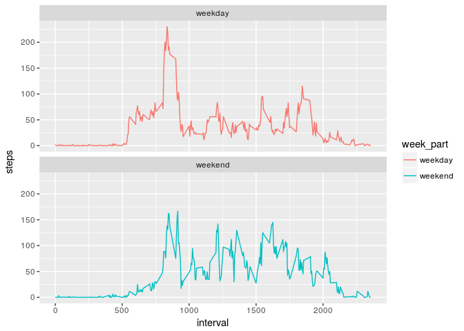

# Reproducible Research: Peer Assessment 1


## Loading and preprocessing the data

First we download the data and unzip it in the working directory (if needed) and read it for further use

```r
dataurl <- "https://d396qusza40orc.cloudfront.net/repdata%2Fdata%2Factivity.zip"
if (!file.exists("project1.zip")){
      download.file(dataurl, "project1data.zip")
} 
if (!file.exists("activity.csv")) { 
      unzip("project1data.zip") 
}

# Read the data
activity <- read.csv("activity.csv", header = T)
```


## What is mean total number of steps taken per day?

To see how many steps per day there are we can do a histogram as the following

```r
daily_steps <- aggregate(steps ~ date, data = activity, FUN = sum, na.rm = T)
daily_mean <- mean(daily_steps$steps)
daily_median <- median(daily_steps$steps)
# Plot the data including marks for the max, min and mean number of steps
hist(daily_steps$steps, breaks = 20, col = "lightgreen",
       xlab = "Number of steps per day",
       main = "Repetitions of number of steps per day")
abline(v = daily_mean, col = "darkred", lwd = 1)
abline(v = daily_median, col = "magenta", lwd = 1)
abline(v = min(daily_steps$steps), col = "darkgreen", lwd = 1)
abline(v = max(daily_steps$steps), col = "darkblue", lwd = 1)
legend(x = "topright", col = c("darkred", "magenta", "darkgreen", "darkblue"), 
       c("Mean", "Median", "Minimum", "Maximum"),  lwd = 1)
```

<!-- -->


The values of the mean and the median are so close to one another that both of them lines overlap in the plot. To compare their respective values we print explicitly both of them

* Mean = 1.0766189\times 10^{4}
* Median = 10765

As expected from the plot, they are very similar.

## What is the average daily activity pattern?

Create a new data frame to contain the new information that we have to analyze aggregating the information of number of steps per 5 min time period.

```r
stepsperday <- aggregate(x=list(steps=activity$steps),
                         by=list(time=activity$interval), FUN=mean, na.rm=TRUE)
plot(stepsperday$time, stepsperday$steps, type = "l", 
     main = "Daily routine on number of steps", xlab = "Time period in 5 mins intervals", 
     ylab = "Average number of steps")
```

<!-- -->

We find the (median) maximum number of steps and on which 5-min interval is it

```r
max_step <- max(stepsperday$steps)
time_max <- stepsperday$time[stepsperday$steps == max_step]
```
The extremal value is 206.1698113 (mean) steps in the 5-min interval 835.

## Imputing missing values

Create the imputed data frame

```r
imputed <- activity   # Create a new data frame so we don't overwrite the original data
meanint <- tapply(imputed$steps, imputed$interval, mean, na.rm=TRUE, simplify=TRUE)
imputed$steps[is.na(imputed$steps)] <- 
      meanint[as.character(imputed$interval[is.na(imputed$steps)])]
```

Calculate how many steps are taken now per time interval and plot it into a histogram

```r
imputed_steps <- aggregate(steps ~ date, data = imputed, FUN = sum, na.rm = T)
imputed_mean <- mean(imputed_steps$steps)
imputed_median <- median(imputed_steps$steps)
# Plot the data including marks for the max, min and mean number of steps
hist(imputed_steps$steps, breaks = 20, col = "lightgreen",
       xlab = "Number of steps per day",
       main = "Repetitions of number of steps per day")
abline(v = imputed_mean, col = "darkred", lwd = 1)
abline(v = imputed_median, col = "magenta", lwd = 1)
abline(v = min(imputed_steps$steps), col = "darkgreen", lwd = 1)
abline(v = max(imputed_steps$steps), col = "darkblue", lwd = 1)
legend(x = "topright", col = c("darkred", "magenta", "darkgreen", "darkblue"), 
       c("Mean", "Median", "Minimum", "Maximum"),  lwd = 1)
```

<!-- -->

Again, the mean and the median are indistinguishable in the plot. Their explicit values are:

* Imputed data frame mean = 1.0766189\times 10^{4}
* Imputed data frame median = 1.0766189\times 10^{4}

Therefore, by introducing the missing values, the mean and the median coincide in the imputed data frame.

## Are there differences in activity patterns between weekdays and weekends?

So far we've been using the "date" data column in the original data frame as a factor. In order to use it as a date data format we must convert it. We then create a new column containing if each day is a weekend or a weekday.

```
## 
## Attaching package: 'dplyr'
```

```
## The following objects are masked from 'package:stats':
## 
##     filter, lag
```

```
## The following objects are masked from 'package:base':
## 
##     intersect, setdiff, setequal, union
```

Aggregate the data and plot the results to compare graphically the weekends and weekdays

```r
stepsint <- aggregate(steps ~ interval + week_part, imputed, mean)

# Load ggplot2
library(ggplot2)

# Plot the results
comparison <- ggplot(stepsint, aes(x=interval, y=steps, color = week_part)) +
  geom_line() +
  facet_wrap(~week_part, ncol = 1, nrow=2)
print(comparison)
```

<!-- -->

From the plots we can deduce that, in general, the individuals walked more on the weekends than on weekdays, probably due to the lack of free time during working days in contrast with the free time available in the weekends.


